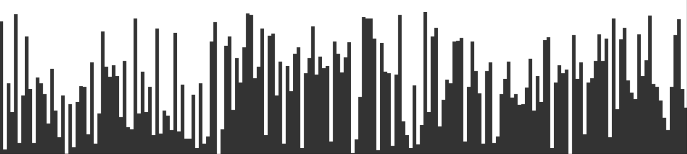

# nok.js

Extremely basic, and <b>not</b> production ready bar chart. Used for my experiments.
```html
<script src="https://cdn.jsdelivr.net/gh/dominikvayrynen/nok.js/nok.js"></script>
```

```js
nok(array, canvasID, color, width, height)

nok([1,2,3,4,5], "MyCanvas", "black")
nok(MyArray, "MyCanvas", "rgba(0,0,0,0.7)", 1000, 200)
```



Examples: https://dominikvayrynen.github.io/nok.js/
